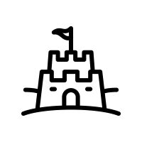

# CREATE {#create}

{width=3in}    

### Learning outcomes {-}  
1. Creatively read scientific literature.  
2. Hone your critical thinking.  
3. Develop a new set of tools for processing readings.  

### CREATE philosophy {-}  
Science is creative. Reading scientific literature can also be a creative process. [Active reading](https://help.open.ac.uk/active-reading) includes highlights, annotation, and note taking. These approaches to reading and study can increase retention, comprehension, and engagement with scientific ideas. However, the teaching philosophy and pedagogy of CREATE is novel and relevant and takes this one step further.  [**CREATE pedagogy**](https://academic.oup.com/genetics/article/176/3/1381/6062159) stands for **C**onsider, **R**ead, **E**lucidate the hypothesis or purpose, **A**nalyze and interpret data or evidence, and **T**hink of the next **E**xperiment. This reading process is creative, active, and phenomenal practice for all professional work.  

If the process seems useful to you, please give it a try for this course. This work is **optional**, but it is literally only 5-10 minutes extra per week. Here are some proposed exercises for you to consider to test out the CREATE approach. If there is time in lectures, we will do them together. Use paper, Powerpoint, or any sketching digital tool you prefer to write or draw. If you elect to try them out and want to submit them as well, **optional**, there are spots provided in [turnitin.com](https://turnitin.com).  


### CREATE applications {-}  

```{r, warning=FALSE, message=FALSE, echo=FALSE}
library(tidyverse)
synthesis <- read_csv("./CREATE.csv") %>% 
  select(- 'teaching strategies')
knitr::kable(synthesis, booktabs = TRUE)

```

