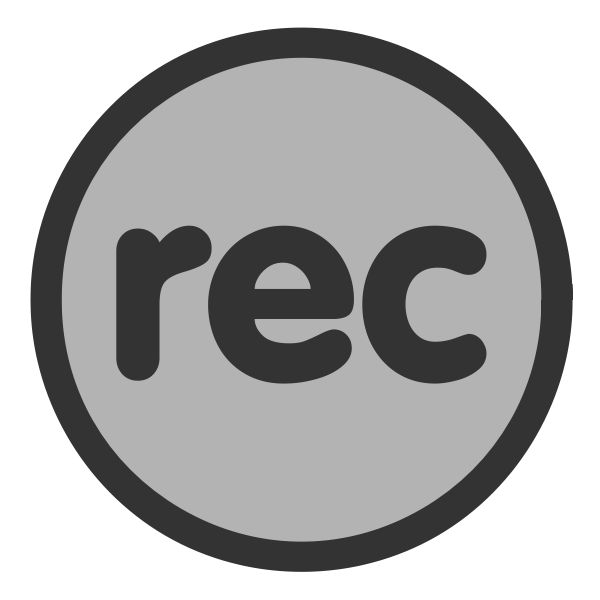

# Recordings {#recordings}

{width=3in}    

### Learning outcomes {-}  
1. Consolidate high-level principles articulated in slide decks.    
2. Review any outstanding key points.  
3. Ensure comprehension of (at times) minimalist slides.  

### Recorded decks {-}  
Brief, slide-only recordings. No discussion or questions included from class. Simple, succinct walk-through of slides for each reading. 
```{r, warning=FALSE, message=FALSE, echo=FALSE}
library(tidyverse)
recordings <- read_csv("./recordings.csv")
knitr::kable(recordings, booktabs = TRUE)

```

