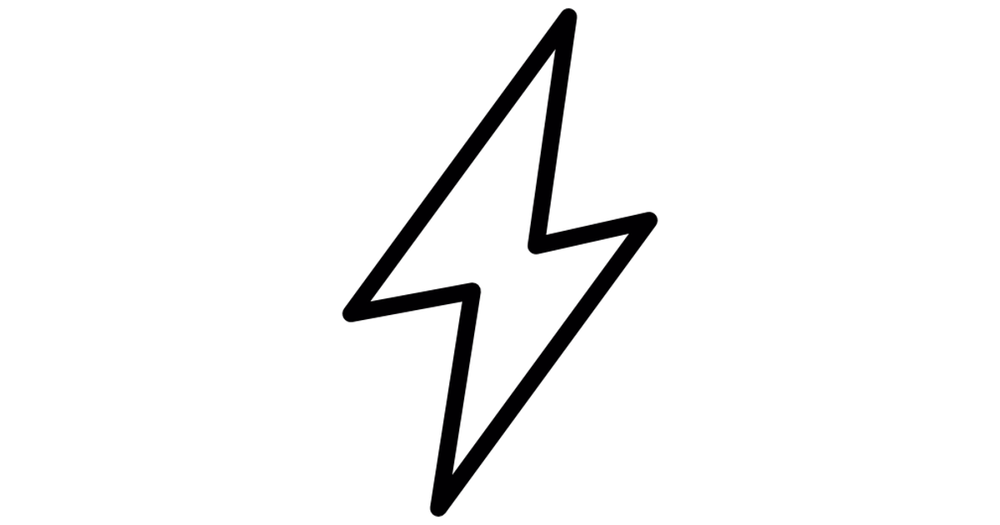

--- 
title: "Experimental design"
author: "cjlortie"
date: ""
site: bookdown::bookdown_site
documentclass: book
bibliography: [book.bib, packages.bib]
biblio-style: apalike
link-citations: yes
description: "The sandbox is a perfect metaphor because there is no perfect experiment -  we can do better experiments!"

---

# Introduction  

{width=4in}  

Experiments shape the human experience. Experiments are a critical component of all natural systems from evolution to community dynamics. Experiments in science are creative, iterative, & source critical thinking. We naturally experiment in art, science, and life. Here, we hone these skills through principles and practice. The principles are here, and the practice is in the form a lab manual entitled ['Designcraft for experiments](https://bookdown.org/cj4nature/designcraft4experiments/).   


### Course outline {-}  

If you are electing to engage with this learning opportunity formally, please see the official course outline for specific details.  

There are three summative assessments.  
1. Test (apply the challenge-solution framework).  
2. Make a scientific comic or infographic for a new challenge of your choice.  
3. Write a super short ignite synthesis paper.  

### Learning outcomes {-} 
1. Critically read environmental science peer-reviewed journal publications.  
2. Reverse-engineer the critical reproducible science tools using peer-reviewed publications.  
3. Appreciate the extent and scope of environmental challenges we face globally.  
4. Explain the balance between direct human needs and environmental health.  
5. Do a formal synthesis such as meta-analysis or systematic review.  
6. Effectively communicate scientific synthesis findings to the public.   

### Steps {-}  
#### Module 1. {-}  
Read a total of 9 useful peer-reviewed science publications.  
Test your practical knowledge by applying to a new challenge.  

#### Module 2. {-} 
Choose your own adventure (i.e. a dimension of an environmental challenge you care about).  
Draw a comic or infographic to communicate challenge to the public.  
Write a short synthesis paper on this topic for a scientific audience.  

#### Rationale {-} 
For each environmental management challenge case examined, students will be responsible for reading the literature provided at their own pace. The professor will facilitate learning as needed.  

The goal is to become more literate environmental citizens and develop, consolidate, and evaluate critical environmental science thinking and problem solving.   

The first module highlights some of the most pressing challenges and more common replicable tools used by the scientific community. The summative test is provided immediately at the start of course to enable asynchronous work and provide a clear, transparent, and testable outcome for this module.   

The second module provides an opportunity for students in this upper-year offering to do a deep dive into a topic that care about deeply. The dimension of the challenge and the solution they pick is open provided it is well articulated. The graphical assignment is a stepping stone or scaffolding to the final paper. It is also a chance to be as creative as students elect to be with communicating science to the public. The final paper is an Ignite, Forum, or Mini-review format contribution on their topic appropriate for a general science journal. These types of papers are increasingly common and important in science and used extensively for evidence-informed decision making by leaders.  

### Citation {-}  
Lortie, CJ (2021): Biology for environmental management pocketguide. figshare. Book. https://doi.org/10.6084/m9.figshare.15031752.v3   


### License {-}  

<a rel="license" href="http://creativecommons.org/licenses/by-nc-sa/4.0/"></a><br />This work is licensed under a <a rel="license" href="http://creativecommons.org/licenses/by-nc-sa/4.0/">Creative Commons Attribution-NonCommercial-ShareAlike 4.0 International License</a>.  

### Topics {-}

{width=3in}    

Here is an overview of the content and topics covered in this course of study. Complete are your own pace, asynchronously. However, please check the official course outline if you are doing the work for credit to ensure you submit summative work at the appropriate times.  

### Instructions {-} 

Read and and use the papers to link environmental challenges that we collectively face with potential solutions. Only one solution per challenge is suggested here, but there are many dimensions to each challenge and numerous solutions too.  

The link to decks are optional. They are my interpretation of the papers from a science-to-magic philosophy and identify the salient elements and concepts from each reading that resonated with my perspective as an ecologist.  

### Schedule {-} 

```{r, warning=FALSE, message=FALSE, echo=FALSE}
library(tidyverse)
schedule <- read_csv("./schedule.csv")
knitr::kable(schedule, booktabs = TRUE)

```


```{r include=FALSE}
# automatically create a bib database for R packages
knitr::write_bib(c(
  .packages(), 'bookdown', 'knitr', 'rmarkdown'
), 'packages.bib')
```
